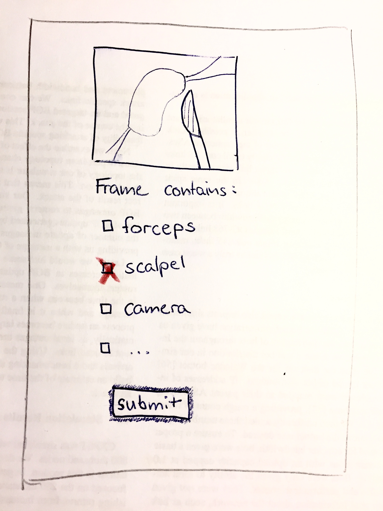

= Pflichtenheft

Komplexpraktikum Computer- und robotergestützte Chirurgie

== Fragestellung

Ein neuronales Netzwerk(NN) wertet aus, welche chirurgischen Instrumente in einem Bild erkennbar sind. Das NN liefert bei einigen Bildern unzuverlässige Ergebnisse. Um das NN zu trainieren, sollen solche problematischen Bilder mit Informationen über enthaltene Intrumente gekennzeichnet werden.

Gefragt ist eine Plattform, auf der Fachkundige auf komfortable Weise automatisch ausgewählte Bilder kennzeichnen.

== Ziele

Die Aufgaben der Software lassen sich in 3 Bereiche unterteilen:

* *Auswahl/sortieren* der für das NN problematischen Bilder
** als _problematisch_ gelten Bilder, bei denen die Wahrscheinlichkeiten für die Instrumente eine Varianz über einem bestimmten Schwellwert besitzen.
** die Bilder sollen nach Varianz sortiert und der Reihe nach dem Anwender präsentiert werden.

* *Präsentation* der Bilder im User Interface. Bestätigung/Anpassung der gefundenen Instrumente durch eine fachkundige Person

* *Verarbeitung/Bereitstellung* der gesammelten Daten für weiteres Training des NN
** gekennzeichnete Bilder sollen vom NN zum weiteren Training verwendet werden.
** sie müssen zurück ins Dateisystem oder in eine Datenbank eingefügt werden

=== Nutzeridentifizierung
Zusätzlich muss jeder Nutzer einen eigenen Zugang haben. Die Bilder sollen verschiedenen Personen präsentiert werden, um Fehler zu verringern.

=== GUI

_User Interface zur Präsentation der Bilder_

== Literatur

== Arbeitspakete (jeweils mit geplanter Bearbeitungszeit)
AP1:

AP2:

AP3:

…
APx:

AP Evaluation:

== Sonstiges
